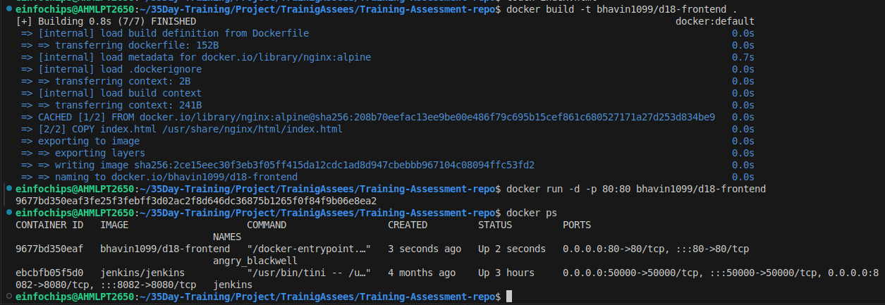
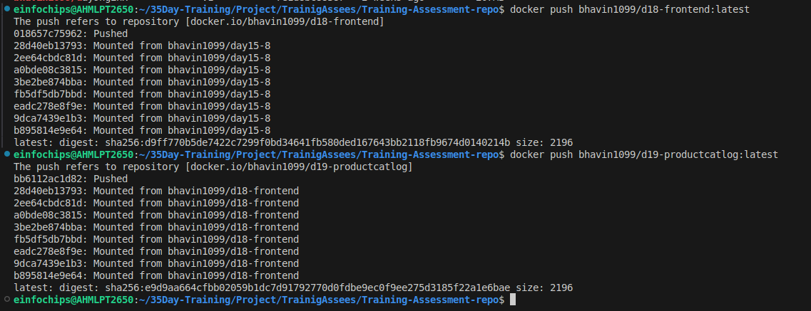
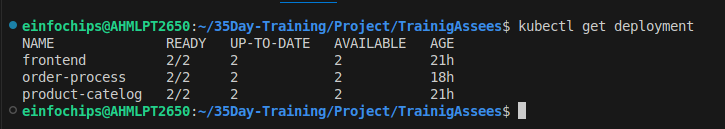
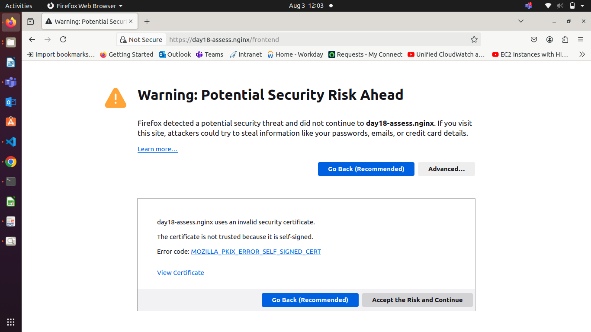
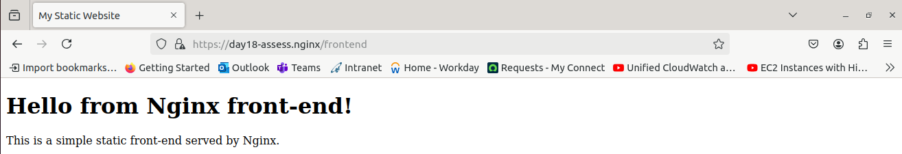
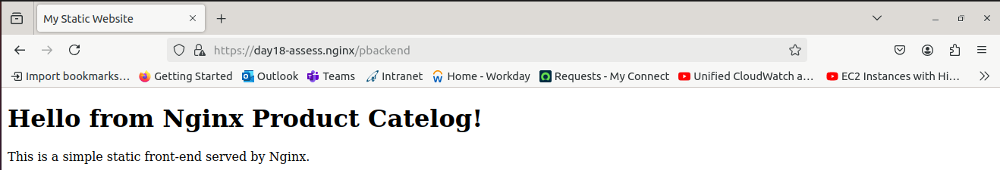
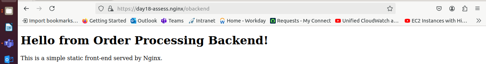

**Assessment: Use Case Oriented Project**

**Project Overview**

You are tasked with setting up a CI/CD pipeline for a microservices-based application. The application will be containerized using Docker and orchestrated using Kubernetes. Ansible will be used for configuration management and deployment. The entire setup should be managed using Git for version control, and Jenkins will be used to automate the CI/CD process.

**Assessment Criteria**

1. **Git**:
   1. Repository setup
   1. Branching strategies
   1. Commit and merge practices
1. **Jenkins**:
   1. Pipeline creation using Jenkinsfile
   1. Integration with Git
   1. Automated build, test, and deployment stages
1. **Docker**:
   1. Dockerfile creation
   1. Image building and management
   1. Containerization of microservices
1. **Kubernetes**:
   1. Pod and service creation
   1. Deployments and replica sets
   1. ConfigMaps and Secrets
1. **Ansible**:
- Playbook creation
- Use of variables and templates
- Inventory management

**Use Case Scenario**

Your company is developing a new e-commerce application consisting of several microservices: a front-end service, a product catalog service, and an order processing service. The goal is to automate the deployment and configuration of these services across development, testing, and production environments using Ansible, Docker, Kubernetes, and Jenkins.

**Tasks and Deliverables**

**Task 1: Git Repository Setup**

1. **Create a Git repository** to store all project files, including Ansible playbooks, Dockerfiles, and Kubernetes manifests.
1. **Branching Strategy**:
- Create branches for development, testing, and production.
- Implement a strategy for merging changes from development to testing and production.

**Task 2: Dockerize Microservices**

1. **Create Dockerfiles** for each microservice (front-end, product catalog, order processing).

  - Dockerfile 
  ```Dockerfile
   FROM nginx:alpine

   COPY index.html /usr/share/nginx/html/index.html

   EXPOSE 80

   CMD ["nginx", "-g", "daemon off;"]
  ```
  - Create index.html for front-end app.
  ```html
<!DOCTYPE html>
<html>
<head>
    <title>My Static Website</title>
</head>
<body>
    <h1>Hello from Nginx front-end!</h1>
    <p>This is a simple static front-end served by Nginx.</p>
</body>
</html>     
  ```
1. **Build Docker images** for each microservice and push them to a container registry (e.g., Docker Hub).
- Build Docker Image by below command
  
      docker build -t bhavin1099/d18-frontend:latest

   
- Push Docker Image into Docker Registry

      docker push bhavin1099/d18-frontend:latest

   
1. **Deliverables**:
- Dockerfiles for each microservice
- Built Docker images in a container registry

**Task 3: Kubernetes Deployment**

1. **Create Kubernetes manifests** for deploying each microservice.
   1. Define Pods, 
   2. Services, 
   3. Deployments, and ReplicaSets.
#### frontend-deployment.yaml to deploy fronend app.   
```yml
# frontend-deployment.yaml to deploy fronend app.
apiVersion: apps/v1
kind: Deployment
metadata:
  name: frontend
spec:
  replicas: 2
  selector:
    matchLabels:
      app: frontend
  template:
    metadata:
      labels:# frontend-deployment.yaml to deploy fronend app.
apiVersion: apps/v1
kind: Deployment
metadata:
  name: frontend
spec:
  replicas: 2
  selector:
    matchLabels:
      app: frontend
  template:
    metadata:
      labels:
        app: frontend
    spec:
      containers:
      - name: frontend
        image: bhavin1099/d18-frontend:latest
        ports:
        - containerPort: 80
        app: frontend
    spec:
      containers:
      - name: frontend
        image: bhavin1099/d18-frontend:latest
        ports:
        - containerPort: 80
```

#### Service for front-end app
```yml
# Frontend-Service 
apiVersion: v1
kind: Service
metadata:
  name: frontend-service
spec:
  selector:
    app: frontend
  ports:
   - protocol: TCP
     port: 80
     targetPort: 80
  type: ClusterIP
```
#### Create backend-deployment.yml for product-catelog.
```yml
# backend-deployment.yaml
apiVersion: apps/v1
kind: Deployment
metadata:
  name: product-catelog
spec:
  replicas: 2 
  selector:
    matchLabels:
      app: product-catelog
  template:
    metadata:
      labels:
        app: product-catelog
    spec:
      containers:
      - name: product-catelog
        image: bhavin1099/d19-productcatlog:latest     
        ports:
        - containerPort: 80
```
#### Create Service for backend-deployment of product-catelog
```yml
# Backend-Service for Product Catelog
apiVersion: v1
kind: Service
metadata:
  name: backend-service
spec:
  selector:
    app: product-catelog
  ports:
   - protocol: TCP
     port: 80
     targetPort: 80
  type: ClusterIP
```
#### Create Deployment for Order-Proccessing.
```yml
# backend-deployment.yaml
apiVersion: apps/v1
kind: Deployment
metadata:
  name: order-process
spec:
  replicas: 2 
  selector:
    matchLabels:
      app: order-process
  template:
    metadata:
      labels:
        app: order-process
    spec:
      containers:
      - name: order-process
        image: bhavin1099/orderprocess:v1     
        ports:
        - containerPort: 80
```
#### Create Service for Order-Processing.
```yml
# oBackend-Service for Order Processing
apiVersion: v1
kind: Service
metadata:
  name: obackend-service
spec:
  selector:
    app: order-process
  ports:
   - protocol: TCP
     port: 80
     targetPort: 80
  type: ClusterIP
```
   1. Use ConfigMaps and Secrets for configuration management.
1. **Deploy the microservices** to a Kubernetes cluster.
  
- Deployment



- Service
   


#### To Control Traffic by Path Based Use Ingress
- ingress.yml
```yml
apiVersion: networking.k8s.io/v1
kind: Ingress
metadata:
  name: assess-ingress
  annotations:
    nginx.ingress.kubernetes.io/rewrite-target: /
    nginx.ingress.kubernetes.io/affinity: "cookie"
    nginx.ingress.kubernetes.io/session-cookie-name: "route"
    # To Use SSL to encryption of the user request
    nginx.ingress.kubernetes.io/ssl-redirect: "true"
spec:
  tls:
  - hosts: # Edit /etc/hosts file -- minikube-ip  domain-name
    - day18-assess.nginx
    secretName: tls-secret
    # Add secret.cert and secret.key into kubernetes deployment. 
    # In my case I give secretname is tls-secret during creation SSL cert.
# spec:
  rules:
  - host: day18-assess.nginx  # defind in /etc/hosts file
    http:
      paths:
      - path: /frontend
        pathType: Prefix
        backend: 
          service:
            name: frontend-service  # If add path /frontend in url "day18-assess.nginx/frontend then this service will use to show frontend app page.
            port:
              number: 80
      - path: /pbackend  # same for Product Catelog,
        pathType: Prefix
        backend:
          service: 
            name: backend-service
            port: 
              number: 80

      - path: /obackend  # same for order processing.
        pathType: Prefix
        backend:
          service: 
            name: obackend-service
            port: 
              number: 80
```

1. **Deliverables**:
- Kubernetes manifests (YAML files)
- Successful deployment of microservices in the Kubernetes cluster

- Varify Frontend App.


- See Frontend Page


- See Product-catelog Page


- See Order-Processing page


**Task 4: Ansible Configuration Management**

1. **Create Ansible playbooks** to manage the deployment and configuration of the microservices.
   1. Use variables to handle environment-specific configurations.
   1. Utilize Jinja2 templates to dynamically generate configuration files.
1. **Set up Ansible inventories** to manage different environments (development, testing, production).
1. **Deliverables**:
- Ansible playbooks
- Ansible inventory files
- Jinja2 templates for configuration files

**Task 5: Jenkins CI/CD Pipeline**

1. **Set up a Jenkins pipeline** using a Jenkinsfile.
   1. Integrate with Git to trigger the pipeline on code changes.
   1. Define stages for building Docker images, pushing them to the registry, deploying to Kubernetes, and running tests.
1. **Implement error handling** and notifications to alert the team on failures.
1. **Deliverables**:
- Jenkinsfile defining the CI/CD pipeline
- Screenshots or logs demonstrating successful pipeline execution

**Evaluation Criteria**

Participants will be evaluated based on the following:

1. **Git**:
   1. Proper repository setup with clear structure and documentation
   1. Effective branching strategy and merge practices
1. **Docker**:
   1. Correct and efficient Dockerfile creation
   1. Successful building and pushing of Docker images
1. **Kubernetes**:
- Accurate and functional Kubernetes manifests
- Successful deployment and management of microservices in the cluster
4. **Ansible**:
   1. Well-structured playbooks with proper use of variables and templates
   1. Effective inventory management for different environments
4. **Jenkins**:
- Comprehensive and functional Jenkins pipeline
- Proper integration with Git and handling of build, test, and deployment stages
- Effective error handling and notifications

**Submission**

Participants should submit the following:

- Git repository URL with all project files
- Docker Hub repository links to the built images
- Screenshots or logs of the Kubernetes deployment
- Jenkins pipeline execution logs or screenshots
- Detailed documentation explaining the setup and configurations
